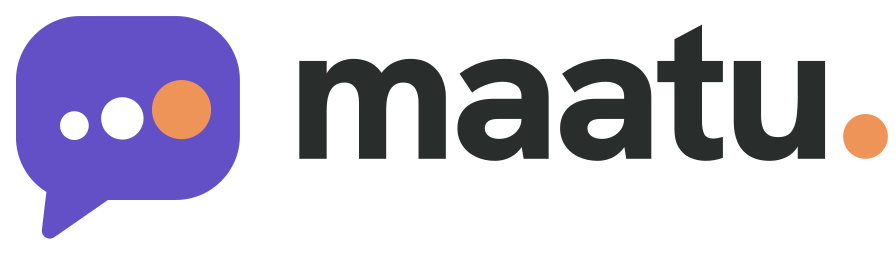

# Maatu

Learn everyday spoken Tamil, Kannada, Hindi, and French at [maatu.nathanielschool.com](https://maatu.nathanielschool.com). Free, no account needed. Language guides: [Tamil](https://maatu.nathanielschool.com/learn/tamil), [Kannada](https://maatu.nathanielschool.com/learn/kannada), [Hindi](https://maatu.nathanielschool.com/learn/hindi), [French](https://maatu.nathanielschool.com/learn/french), and [About Maatu](https://maatu.nathanielschool.com/about).

Maatu is the Kannada word for speech.

Three ways to learn share the same language choices and teaching principles:

- **Just talk:** ordinary voice or text conversations about any topic. The teacher teaches softly while you talk: it answers what you meant, gives your own sentence back in the target language, folds any correction into the reply, and keeps the conversation going. Typed replies add one small tip when a mistake matters, and any phrase can be shown and heard in Tamil, Kannada, Hindi, Malayalam, Telugu and French. Text history carries into a voice call.
- **Real-life scenes:** 20 scenes per language, each with 3 to 6 situations to choose from and a translated first line: auto, app cab, vegetable market, grocery store, eatery, hospital help desk, clinic, pharmacy, buying health insurance, negotiating an insurance claim, a music class at Nathaniel School, the Nathaniel School front desk (answers from `knowledge/nsm-school.md`), and more, rooted in Chennai, Bengaluru, Delhi, and Paris. Characters stay in the scene, echo the right form back naturally, and give one English help sentence when asked. City photographs document actual places; they do not depict the fictional characters.
- **Sentence lab:** a playable dependency board connects Pronoun or Proper noun, Verb, Noun, Adjective, and Time & tense. Choose free build or four meaning-based challenges, with useful hints and completion saved separately for each language. Reuse pronouns, proper names, 30 actions, suitable nouns, adjectives, and time choices. Compare the same choices across all four languages, change gender, ask a question, make it negative, hear it, save it, and practise with your teacher.

Each language also has the same 16-lesson beginner course. Close attempts count; meaningful mistakes get one correction and one retry. English meaning questions come first. Pausing, repetition, explanation, slower speech, and going back keep the activity on track. Lesson completion requires a final speaking check, never merely opening a call.

Indian-language captions use romanized Latin. The voice receives native script or native speech, and French keeps its normal accents. Pronunciation follows Chennai Tamil, Bengaluru Kannada, Delhi Hindi, and Paris French. Model output still benefits from human native-speaker review.

## Runtime

Next.js PWA on Vercel, LiveKit Cloud for live audio, and Neon for grounded call reports. Indian-language calls use Sarvam Saaras v4 recognition locked to the call language, the Gemini 3.5 Flash teaching brain and fixed Sarvam voices (Bulbul v4 flash for Kannada, v3 for Hindi and Tamil); French calls use Gemini 3.8 Live. The named production worker is `maatu-studio`, hosted in LiveKit Cloud's India region. Calls work without an awake Mac. Provider checks and the verdict on Sarvam are in `docs/VOICE_PROVIDERS.md`. Preview speech prepares stable sentences in the background and shares cached audio across Hear it controls. The starter and all four challenge goals have saved normal/slower audio in every language, so those previews need no model request. New Indic previews use native-script Sarvam Bulbul v3 with Gemini fallback; French uses native Gemini speech.

Vercel's production branch is `main`. Deploy from the repository root. Redeploy the cloud worker with `PRODUCTION=1 scripts/deploy_cloud_agent.sh`; its data includes `french-reference.txt`, all persona JSON, and the existing full teaching prompts.

## Brand, search and answer engines

- **Logo:** a speech bubble whose dots grow, the last one in warm marigold: a few words today, more courage tomorrow. The same round voice dot is the full stop in the wordmark. Files in `public/brand/` (SVG with outlined lettering, PNG, 1024 px app icon); the in-app mark is `app/components/BrandMark.tsx`. Purple `#6350c6`, voice `#ee9459`, paper `#fbf9f4`.
- **Icons:** `app/icon.svg` and `app/favicon.ico` for browsers, `app/apple-icon.png` for iPhone home screens, any and maskable PNGs for Android in `public/`.
- **Public pages:** `/learn`, `/learn/{tamil,kannada,hindi,french}` and `/about` are server-rendered, so search engines and AI crawlers that do not run JavaScript read the full content. Every claim on them is built in `lib/site.ts` from the app's own lessons, scenes and characters, so the public description cannot drift from the product.
- **Search:** titles, descriptions, canonical URLs on the branded domain, Open Graph and Twitter cards with a share image per language (`public/og/`), `robots.txt`, `sitemap.xml`, and schema.org data (`lib/structured-data.ts`: Organization, WebSite, WebApplication, Course, FAQPage, BreadcrumbList).
- **Answer engines:** `/llms.txt` gives AI assistants a plain-text summary with the languages, course, scenes and FAQ answers. AI crawlers are allowed.
- **Deep links:** `/?lang=kn&mode=scenes` opens the studio in a language (`ta`, `kn`, `hi`, `fr`) and mode (`scenes`, `build`, `course`). The address is tidied after opening.

## Verification and project records

- `scripts/verify-learning.ts`: 13 linguistic golden cases, 130,432 structurally valid combinations, 80 scenario records, and 64 lesson routes.
- `scripts/verify-romanize.ts`: 50 golden caption words across Tamil, Kannada, Hindi, Malayalam and Telugu. Structural coverage is not an exhaustive native-speaker grammar certification.
- `scripts/verify-sentence-game.ts`: semantic challenge checks across all four languages, rejection of incorrect meanings, proper names/agreement, and compatible word changes.
- `scripts/verify-lab-voice.ts`: 40 saved playable clips plus concurrent-request and cached-audio equality; prints fresh and cached timing measurements.
- `scripts/prepare-lab-voices.ts`: regenerate the saved starter and challenge voices through the configured speech endpoint.
- `scripts/e2e_voice_probe.py`: real LiveKit calls using synthetic spoken learner audio, multi-turn sequences, and reliable control acknowledgments.
- `.impeccable/review/`: production screenshots, visual review, and the ordered fix verdict.
- `PRODUCT.md` and `DESIGN.md`: product principles and the implemented design system.
- `TASKS.md` and `DECISIONS.md`: milestones and implementation choices.
- `public/photo-credits.txt`: photo sources and licenses, linked from settings.
- `docs/plan/`: the original briefs. `CLAUDE.md` contains standing project instructions.

Measured cloud turns remain around two seconds, above the strict 1.5-second budget. Preserve teaching quality while improving latency in the pipeline.

A Nathaniel School of Music project by Jason Zac. Copyright Nathaniel School of Music. All rights reserved. Street photographs are used under the Creative Commons licences listed in `public/photo-credits.txt`.

<!-- REPORT: agent=Claude; task=public-launch-seo-brand; status=complete; files=README.md; open_questions=none -->
